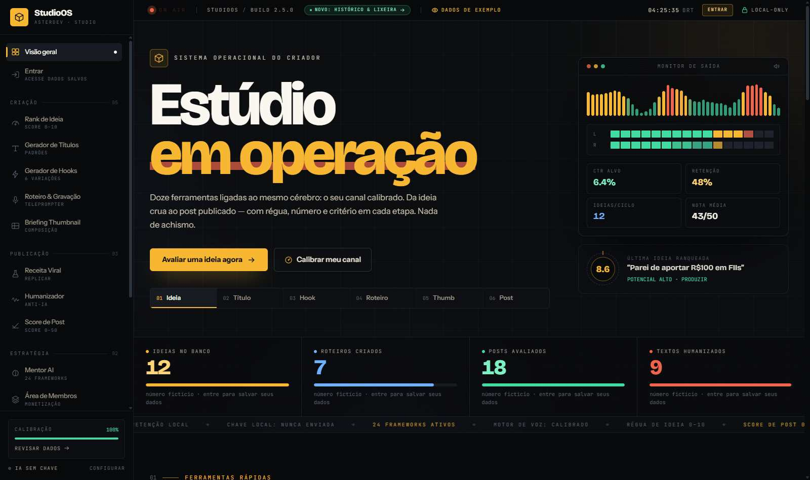
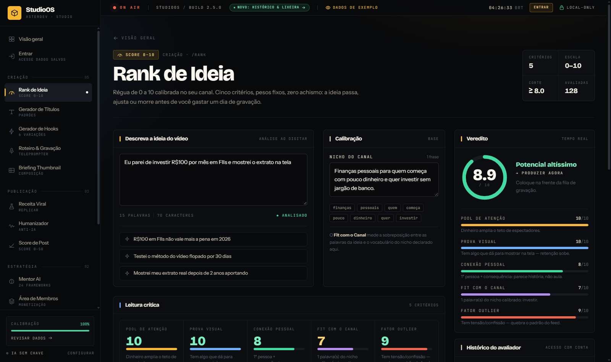

# StudioOS

Painel de criação para quem publica vídeos e conteúdo em redes sociais. As ferramentas compartilham uma calibração de canal e ajudam a avaliar ideias, criar títulos e hooks, montar roteiros, revisar posts e planejar uma área de membros.

## Prévia

### Visão geral



### Rank de Ideia



## Acesso e dados

- É possível abrir as ferramentas e experimentar os exemplos sem entrar em uma conta. As contagens da visão geral para visitantes são fictícias e servem apenas para demonstrar o painel.
- Entre ou crie uma conta para acessar o histórico de análises e a lixeira. Sem sessão, esses registros ficam protegidos e as ferramentas não salvam execuções no histórico.
- Depois do login, os campos de entrada começam vazios para você usar os dados do seu canal.
- O histórico, a lixeira, a calibração e as configurações ficam no armazenamento local do navegador. A autenticação pelo Supabase controla o acesso, mas não sincroniza esses dados entre dispositivos.
- Sem credenciais Supabase, o cadastro e o login funcionam em modo demo neste navegador. As contas demo não são compartilhadas com outros dispositivos.

## Requisitos

- Node.js `>=22.12.0`
- npm

## Desenvolvimento

```sh
npm install
npm run dev
```

O comando inicia o Astro em segundo plano. Acesse `http://localhost:4321`. Para gerenciar o servidor:

```sh
npx astro dev status
npx astro dev logs
npx astro dev stop
```

## Configurar autenticação Supabase

1. Copie `.env.example` para `.env`.
2. Preencha `PUBLIC_SUPABASE_URL` e `PUBLIC_SUPABASE_ANON_KEY` com os valores do painel **Project Settings → API**.
3. Execute `supabase/schema.sql` no SQL Editor do projeto Supabase.
4. Habilite os provedores de autenticação desejados no Supabase e reinicie o servidor Astro.

Use somente a chave pública `anon` ou `publishable` no navegador. Nunca exponha uma chave `service_role` em variáveis `PUBLIC_` ou no código cliente.

## Ferramentas

- **Criação:** Rank de Ideia, Gerador de Títulos, Gerador de Hooks, Roteiro & Gravação e Briefing Thumbnail.
- **Publicação:** Receita Viral, Humanizador e Score de Post.
- **Estratégia:** Mentor AI e Área de Membros.
- **Painel:** Calibração do Canal e Wiki.
- **Conta:** histórico, restauração de análises e lixeira com retenção configurável.

## Estrutura do projeto

```text
src/
├── pages/          Rotas Astro: visão geral e login
├── layouts/        Layout e metadados da página
├── studio/         Aplicação React, autenticação, ferramentas e componentes
│   ├── tools/      Ferramentas e autosave
│   ├── views/      Visão geral, autenticação e histórico
│   └── components/ Navegação, indicadores e componentes compartilhados
├── skills/         Instruções usadas pelas ferramentas
└── styles/         Estilos globais e tema do StudioOS
public/             Logo e favicon em SVG
docs/images/        Capturas usadas neste README
supabase/           Esquema SQL e políticas de acesso
```

## Tecnologias

Astro, React, TypeScript, Tailwind CSS v4 e Supabase Auth.
